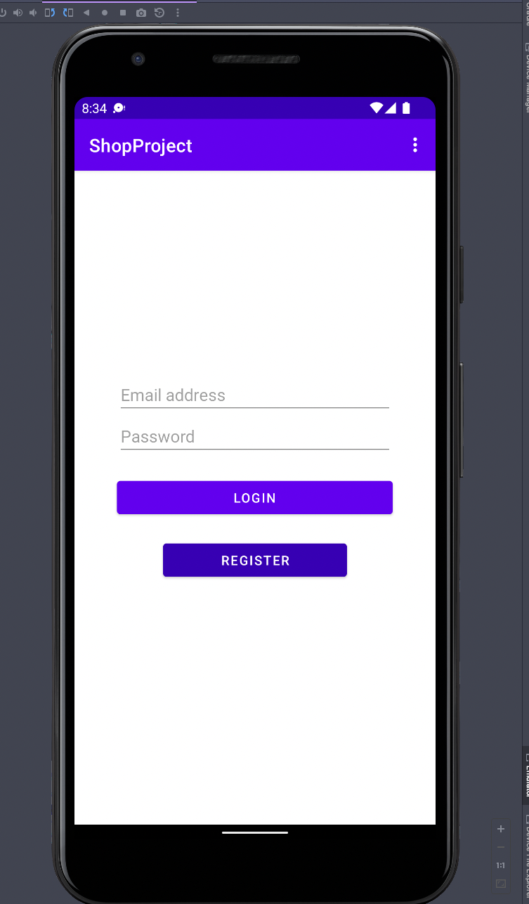
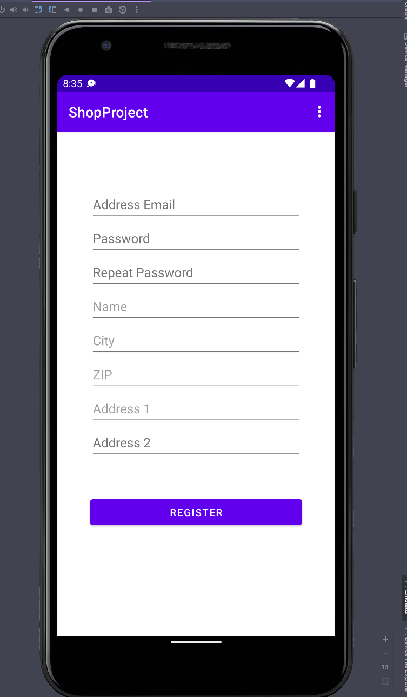
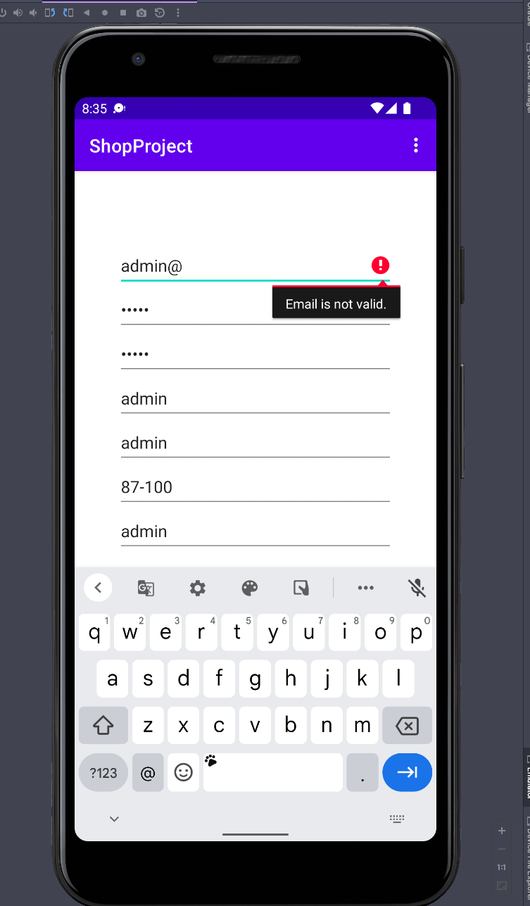
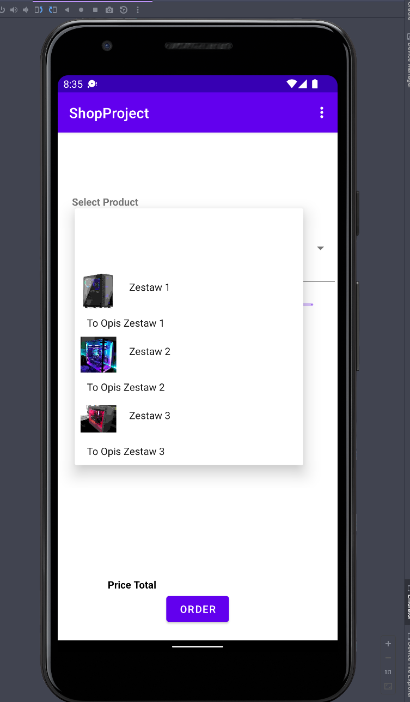
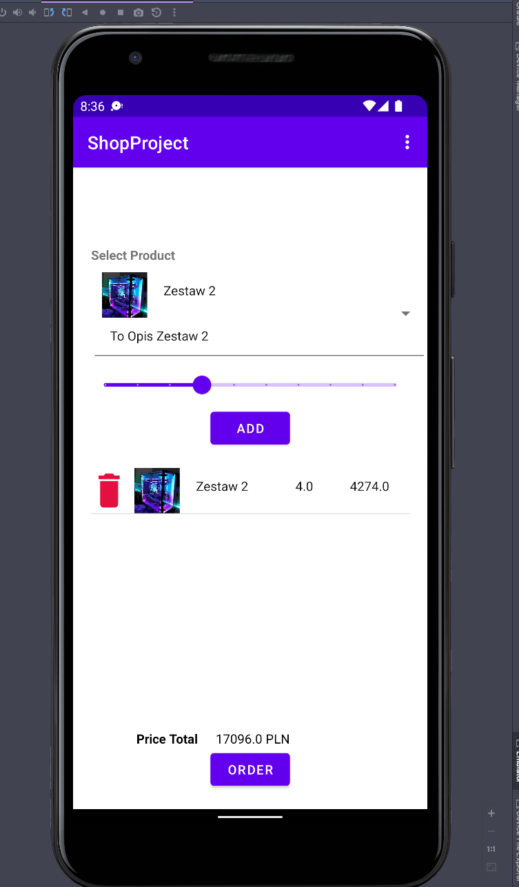

# SchoolShopProject
School assignment android app written in Java.

## Screenshots

### Login View

### Register View (with data validation)

### Create Order / Cart View

## Functionalities
- SQLite3 database
- Auto create db
- Auto fill initial datas
- Custom adapters for generate dynamic elements
- Input data validation
- Simple ORM
